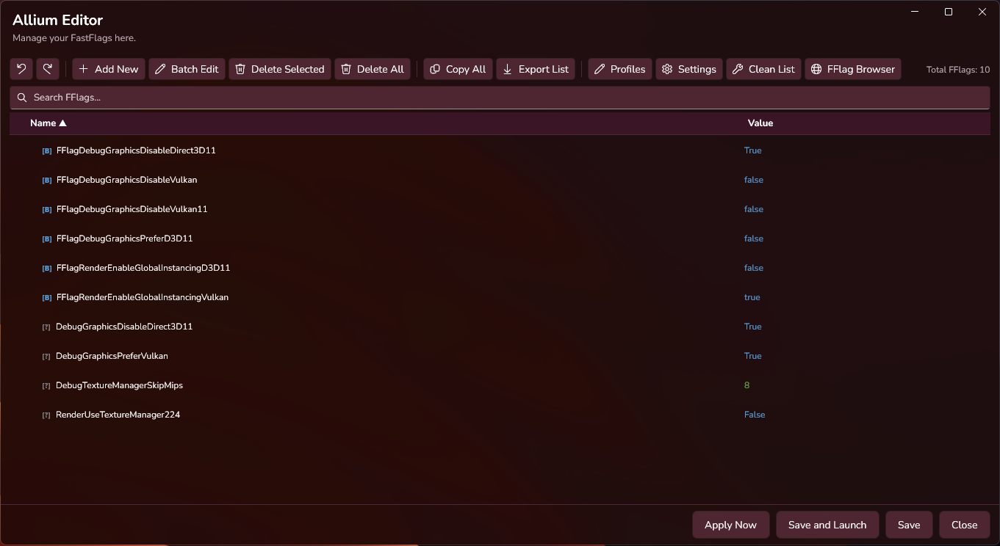
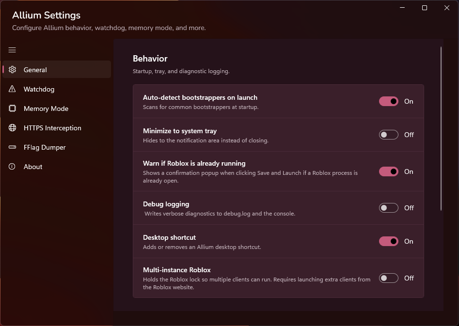
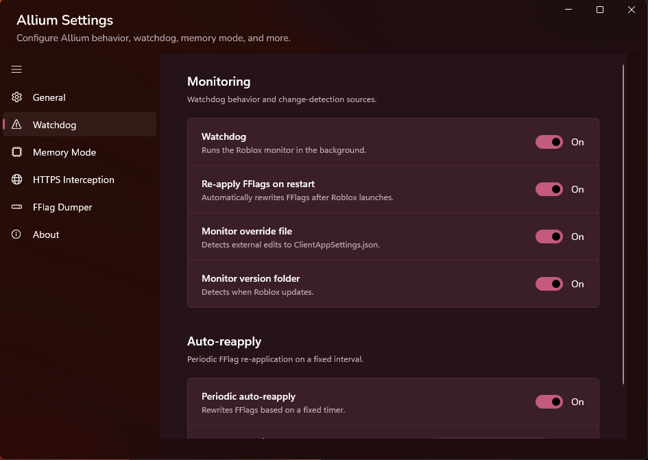
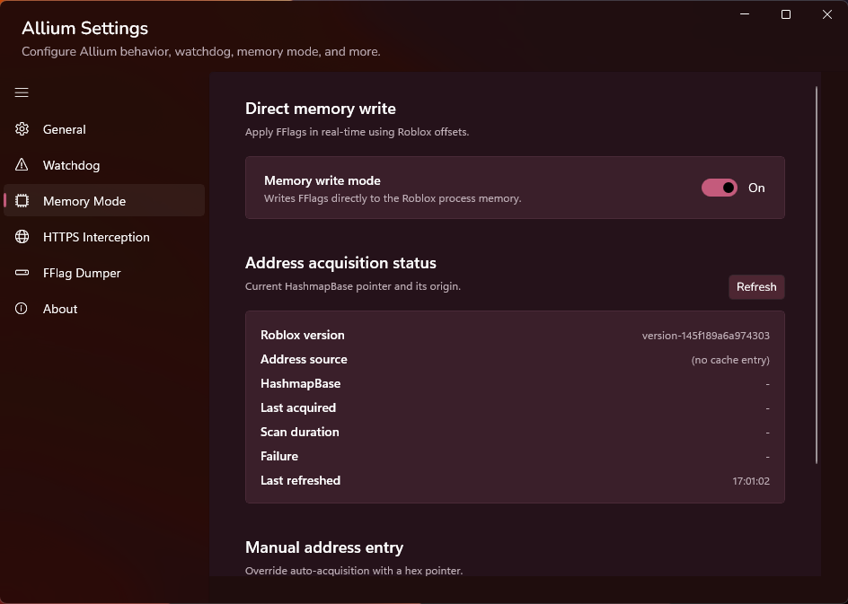
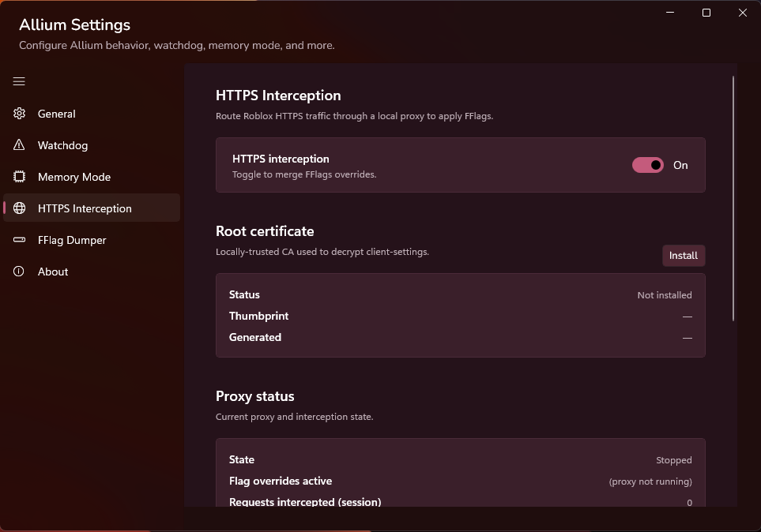
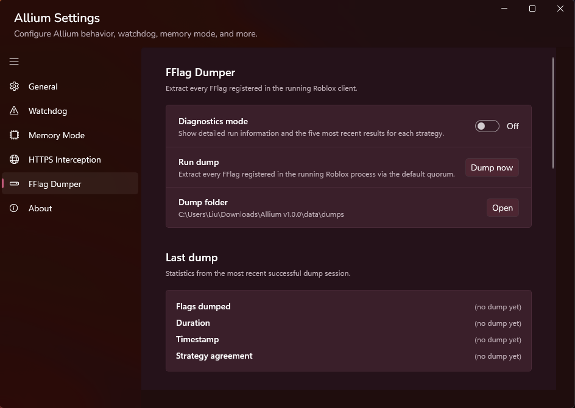
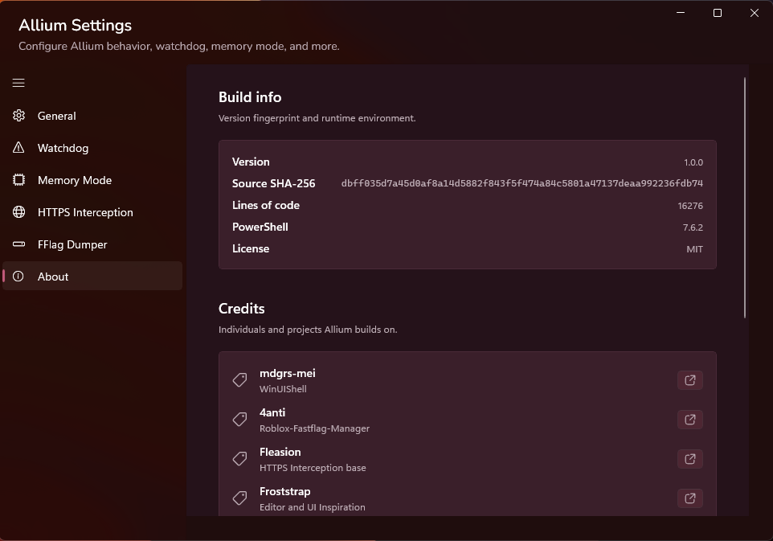

<div align="center">


# Allium

### A fluent Windows app for discovering, editing, applying, and managing Roblox FastFlags

https://img.shields.io/github/v/release/fwOnion/Allium?style=for-the-badge&label=Release](https://github.com/fwOnion/Allium/releases/latest)
https://img.shields.io/github/downloads/fwOnion/Allium/v1.0.0/Allium-v1.0.0.zip?style=for-the-badge&logo=github&logoColor=white&label=ZIP%20Downloads&color=2ea44f](https://github.com/fwOnion/Allium/releases/download/v1.0.0/Allium-v1.0.0.zip)
https://img.shields.io/badge/Discord-Join%20the%20community-5865F2?style=for-the-badge&logo=discord&logoColor=white](https://discord.gg/gFK9fhMUQm)
https://img.shields.io/badge/Platform-Windows-0078D4?style=for-the-badge&logo=windows&logoColor=white](#requirements)
https://img.shields.io/badge/PowerShell-7.4%2B-5391FE?style=for-the-badge&logo=powershell&logoColor=white](#requirements)
https://img.shields.io/github/license/fwOnion/Allium?style=for-the-badge](LICENSE)

[Download the latest release](https://github.com/fwOnion/Allium/releases/latest) · [Installation guide](docs/installation.md) · [Security and privacy](docs/security-and-privacy.md) · [Troubleshooting](docs/troubleshooting.md) · [Discord support](https://discord.gg/gFK9fhMUQm)

</div>

> [!IMPORTANT]
> Download `Allium-v1.0.0.zip` from the **Assets** section of the latest release. Do not use GitHub's automatically generated **Source code** archives as the normal installer package.

Allium combines a FastFlag editor, searchable flag browser, profiles, launch controls, monitoring, memory tools, HTTPS interception controls, and a strategy-based FastFlag dumper in one WinUI interface.


---

## At a glance

- Edit, search, import, export, organize, and apply Roblox FastFlags.
- Browse known FastFlags from multiple configured data sources.
- Save reusable profiles and merge profiles into the current collection.
- Detect supported Roblox installations and compatible bootstrappers.
- Monitor Roblox, version, and configuration changes with the watchdog.
- Apply supported values to a running Roblox process through optional memory mode.
- Manage optional local HTTPS interception, hosts entries, and certificate state.
- Run strategy-based FastFlag dumps with validation, merging, and persistence.
- Use the graphical launcher, editor, browser, settings, progress dialogs, tray controls, and built-in logs.

---

## Screenshots

<!--
Add verified screenshots when available. Approved paths:








-->

Verified screenshots are not published yet. See [the screenshot intake guide](docs/screenshots/README.md) for the approved filenames and privacy requirements.

---

# Beginner installation

No terminal commands are required for the normal first-time setup.

## 1. Download Allium

1. Open the [latest Allium release](https://github.com/fwOnion/Allium/releases/latest).
2. Scroll to **Assets**.
3. Download `Allium-v1.0.0.zip`.
4. Optionally download `SHA256SUMS.txt` if you want to verify the ZIP before opening it.

> [!CAUTION]
> GitHub also displays **Source code (zip)** and **Source code (tar.gz)**. Those are automatic repository snapshots. Choose `Allium-v1.0.0.zip` for the normal Allium package.

## 2. Extract the ZIP

1. Open **File Explorer** and go to **Downloads**.
2. Right-select `Allium-v1.0.0.zip`.
3. Select **Extract All**.
4. Choose a folder you can write to, such as a folder inside **Documents**.
5. Open the extracted folder.

Keep these two files together in the same folder:

```text
Allium-Setup.ps1
Allium.ps1
```

Do not run either script from inside the ZIP preview.

## 3. Run setup with File Explorer

1. Right-select `Allium-Setup.ps1`.
2. Select **Run with PowerShell**.
3. Approve the Windows administrator prompt if it appears.
4. Let setup check and install the required components.
5. When setup is complete, select **Launch Allium** inside the setup window.

### Windows 11 note

If **Run with PowerShell** is not visible in the first context menu:

1. Right-select `Allium-Setup.ps1`.
2. Select **Show more options**.
3. Select **Run with PowerShell**.

PowerShell 7 can also provide a **Run with PowerShell 7** entry, but Microsoft documents a known Windows 11 context-menu issue where that entry may not appear. Allium setup checks for the required PowerShell version and handles the PowerShell 7 prerequisite. See [Microsoft's Run with PowerShell documentation](https://learn.microsoft.com/en-us/powershell/module/microsoft.powershell.core/about/about_run_with_powershell?view=powershell-7.6).

## 4. Launch Allium later

You can use either method:

### Method A: Use setup as the launcher

1. Right-select `Allium-Setup.ps1`.
2. Select **Run with PowerShell**.
3. Let setup verify the installation.
4. Select **Launch Allium**.

### Method B: Launch Allium directly

1. Right-select `Allium.ps1`.
2. Select **Run with PowerShell**.
3. Approve the Windows administrator prompt if it appears.

> [!TIP]
> Keep the extracted Allium folder in a permanent location. Allium stores its local data beside the scripts under `data`.

---

## Requirements

- x64 Windows 10 build 17763 or later, or Windows 11
- PowerShell 7.4 or later
- Internet access during first-time setup
- Administrator approval for system-wide setup operations
- A user-writable folder for Allium and its local data

ARM64 is not declared supported for Allium v1.0.0 because the current fallback installers are x64.

### Setup-managed components

Setup checks, installs, or configures the components required by Allium, including:

- PowerShell 7.4 or later
- Windows App SDK Runtime 1.6 for x64
- Microsoft PowerShell PSResourceGet
- WinUIShell 0.12.0 or later
- ZstdSharp.Port 0.8.8 under Allium's local dependency folder
- Nunito and Sono fonts, unless font installation is skipped
- Allium's local data-directory structure

Allium does not automatically update WinUIShell after installation. Versions newer than the tested 0.12.x series may display a compatibility warning.

Setup may set the CurrentUser PowerShell execution policy to `Unrestricted`, install components for all users, trust PowerShell Gallery, and remove downloaded-file zone markers from supported Allium files. Review [Installation](docs/installation.md) and [Security and privacy](docs/security-and-privacy.md) before running setup.

---

# Features

The following list is derived from functionality present in the Allium source. Availability can depend on Roblox version, installed dependencies, selected settings, network access, and the data returned by configured sources.

## FastFlag editor

- Add a single FastFlag with a name and value.
- Import one or more FastFlags from JSON.
- Paste FastFlag JSON from the clipboard.
- Add FastFlags through drag and drop.
- Edit an individual flag.
- Batch-edit selected flags.
- Delete selected flags or clear the full list.
- Pin selected flags.
- Search and filter the editor list.
- Select or deselect visible items.
- Copy selected names, selected values, selected flags as JSON, or the complete collection.
- Export the current collection to a JSON file.
- Detect a FastFlag value type from its name.
- Clean empty, duplicate, or invalid entries.
- Undo and redo editor changes.
- Save flags locally.
- Write FastFlags to Roblox client settings.
- Save, apply, and launch Roblox from the editor workflow.
- Supports writing both prefixed and unprefixed FFlags.
- Display editor notifications, progress, status, and console output.
- Use context menus and keyboard shortcuts for common editor actions.

## FastFlag browser and sources

- Open a separate searchable FastFlag browser.
- Fetch lists from multiple configured FastFlag sources.
- Fetch supported sources in parallel.
- Merge and process returned results.
- Search, filter, select, and deselect browser results.
- Add selected browser results to the editor.
- Copy selected FastFlag names.
- Drag supported browser selections.
- Cache supported source results.
- Display fetch progress, loading state, status, and source results.
- Use browser keyboard shortcuts and context-menu actions.

Configured source references in the application include Roblox client tracking and community-maintained FastFlag and offset data. External sources retain their own availability and terms. See [Third-party notices](THIRD-PARTY-NOTICES.md).

## Profiles

- Save the current FastFlag collection as a profile.
- Load a saved profile.
- Load a profile by name.
- Update an existing profile.
- Delete a profile.
- Merge a profile into the current FastFlag collection.
- Browse profiles through a dedicated interface.
- Store profiles under Allium's local data folder.

## Roblox installations and bootstrappers

- Discover Roblox installations and player executables.
- Locate the Roblox `ClientSettings` path.
- Detect supported compatible bootstrappers.
- Select a detected bootstrapper.
- Add a custom bootstrapper executable.
- Remove a custom bootstrapper entry.
- Build a launcher menu from detected and custom entries.
- Launch Roblox through the selected installation or bootstrapper.
- Save and apply FastFlags before launch.

## Watchdog and automatic reapplication

- Enable or disable watchdog monitoring.
- Monitor the FastFlag configuration file.
- Monitor Roblox version changes.
- Detect Roblox process restarts.
- Reapply FastFlags after supported restart events.
- Periodically reapply FastFlags.
- Configure the periodic reapplication interval.
- Start and stop watchdog behavior.
- Record watchdog events in Allium's logs.

## Memory application

> [!WARNING]
> Memory mode is an advanced, optional feature. Use it only on a computer, process, and account you are authorized to control. Compatibility can change with Roblox updates.

- Identify a running Roblox process for supported operations.
- Acquire and validate memory addresses used by supported FastFlag operations.
- Enter a memory address manually.
- Cache address data locally.
- Display address status and history.
- Read offset and relative-address data from configured sources.
- Fetch supported offset sources in parallel.
- Merge address results through quorum logic.
- Refresh address acquisition state from the settings interface.
- Apply a single value across supported flags.
- Apply toggle-style values.
- Apply values on a per-flag basis.
- Apply supported values in batches.
- Read and write supported typed FastFlag values.
- Surface acquisition diagnostics and validation messages.

## HTTPS interception controls

> [!WARNING]
> HTTPS interception is an advanced, optional feature that can modify the local hosts file and install local certificate material. Review [Security and privacy](docs/security-and-privacy.md) before enabling it. Never share generated private keys or certificate bundles.

- Prepare local HTTPS-interception data directories.
- Install and remove Allium-managed hosts-file entries.
- Register and unregister hosts-file watchdog behavior.
- Install and remove the Allium local certificate authority.
- Display certificate and interception status.
- Start and stop supported HTTP or HTTPS interception behavior.
- Back up supported files before modifying them.
- Restore Allium-created backups.
- Expose related controls and status through the settings interface.

## FastFlag dumper

> [!NOTE]
> Dumper results depend on the selected strategy, Roblox version, process state, data-source availability, and validation results.

- Run dumps through a named strategy registry.
- Execute supported dumper work asynchronously with progress reporting.
- Use hash-map dumping.
- Use static dumping.
- Use container-scan dumping.
- Use flag-value-map dumping.
- Use supported external-source dumping.
- Merge dump results through quorum logic.
- Validate generated dump data.
- Persist dump results under Allium's local data folder.
- Maintain supported FastFlag genealogy and diagnostic data.
- Repair supported flag-value-map type data.
- Display dumper progress and completion state.

## Interface and productivity

- WinUI interface provided through WinUIShell.
- Main launcher window.
- FastFlag editor window.
- FastFlag browser window.
- Settings window with general, watchdog, memory, HTTPS, and about pages.
- Dark visual styling and system accent resource handling.
- Custom dialogs, confirmation prompts, input prompts, teaching tips, and notifications.
- Keyboard accelerators for supported editor and browser actions.
- Context menus and flyouts.
- Progress bars, progress rings, and progress dialogs.
- System tray integration.
- Splash and launching windows.
- Built-in console log display.
- Clear and copy log actions.
- Nunito interface font and Sono monospace font support installed by setup unless skipped.

## Data safety and diagnostics

- Atomic JSON writes for supported data files.
- One-time backup creation for supported modified files.
- Backup restoration.
- Local settings and flag persistence.
- Corrupt-settings recovery through setup.
- Settings migration handling.
- Cache creation and freshness checks.
- Structured console logging.
- Diagnostic-bundle creation.
- Dependency and source-availability checks.
- Verification and uninstall modes in setup.

---

## Local data

Allium creates and uses a `data` folder beside the scripts. Depending on enabled features, the folder can contain settings, flags, profiles, caches, patterns, anchors, per-flag address data, dumps, dependencies, logs, backups, and certificate-related material.

Do not publish or share the complete `data` folder without reviewing it for private information.

---

## Setup verification and uninstall

Advanced users can run setup modes from PowerShell 7:

```powershell
pwsh -NoProfile -File .\Allium-Setup.ps1 -Verify
```

```powershell
pwsh -NoProfile -File .\Allium-Setup.ps1 -Uninstall
```

Uninstall backs up and removes Allium's local `data` directory, removes known Allium-installed font files, and attempts to remove WinUIShell. It does not remove every system dependency or restore every system setting changed during setup. Review [the full installation guide](docs/installation.md) first.

---

## Security and responsible use

Allium works with local Roblox configuration and includes optional advanced features involving process memory, local monitoring, hosts-file changes, and certificate material.

- Use Allium only on systems and accounts you are authorized to control.
- Review advanced settings before enabling them.
- Do not post certificates, private keys, cookies, account data, raw memory dumps, full settings files, or unsanitized logs in public issues.
- Report vulnerabilities privately by following [SECURITY.md](SECURITY.md).
- Read [Security and privacy](docs/security-and-privacy.md) for feature-specific considerations.

---

## Community and support

Join the [Discord Server](https://discord.gg/gFK9fhMUQm) for general support, ordinary bug reporting, and community FastFlag configurations/lists.

Security vulnerabilities should be reported privately through [GitHub private vulnerability reporting](https://github.com/fwOnion/Allium/security/advisories/new). Do not post private keys, certificate bundles, tokens, raw memory dumps, or sensitive proof-of-concept material in public channels.

---

## Troubleshooting

Start with [Troubleshooting](docs/troubleshooting.md).

When reporting a reproducible issue, include:

- Allium version
- Windows version and build
- PowerShell version
- The affected feature
- Minimal reproduction steps
- Expected and observed behavior
- Sanitized diagnostics with private data removed

Use the repository's structured bug-report form for public bugs. Security issues should not be posted publicly.

---

## Project structure

The two runnable scripts remain at repository root on purpose:

```text
Allium.ps1
Allium-Setup.ps1
```

Keeping the files together makes the release easier to extract and run from File Explorer. Setup also locates `Allium.ps1` relative to the setup script's folder.

Repository documentation, workflows, and assets remain organized under `docs`, `.github`, `scripts`, and `assets`.

---

## Documentation

- [Installation](docs/installation.md)
- [Troubleshooting](docs/troubleshooting.md)
- [Security and privacy](docs/security-and-privacy.md)
- [Security policy](SECURITY.md)
- [Contributing](CONTRIBUTING.md)
- [Third-party notices](THIRD-PARTY-NOTICES.md)
- [Changelog](CHANGELOG.md)

---

## License

Allium is released under the [MIT License](LICENSE).

Third-party components, fonts, services, and data sources retain their respective terms. See [THIRD-PARTY-NOTICES.md](THIRD-PARTY-NOTICES.md).

---

<div align="center">

**[Download Allium](https://github.com/fwOnion/Allium/releases/latest)**

Built with PowerShell, WinUIShell, and the Windows App SDK.

</div>
